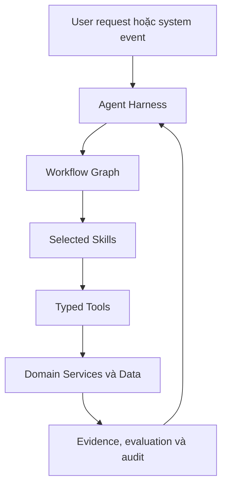
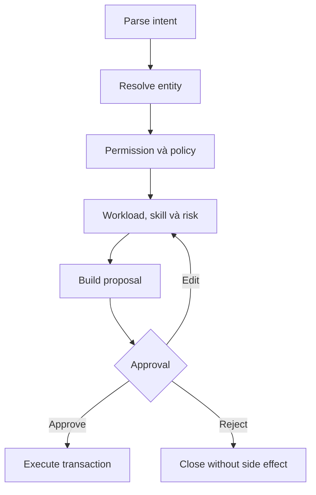

# AI-Native Enterprise Task & Work Management Platform

## Bản mô tả năng lực hệ thống đa domain dành cho Coding Agent

> Tài liệu này mô tả **hệ thống có thể làm gì, người dùng sử dụng nó như thế nào, AI được tổ chức ra sao và đâu là phạm vi khả thi của sản phẩm**.
> Đây chưa phải implementation plan. Coding Agent phải dùng tài liệu này làm nguồn yêu cầu để tạo PLAN, thiết kế kiến trúc và chia phase triển khai.

---

## 1. Hệ thống này là gì?

Đây là một nền tảng **AI-native task and work management dành cho doanh nghiệp thuộc nhiều domain**, không giới hạn trong phát triển phần mềm.

Hệ thống có thể được sử dụng cho:

- Vận hành doanh nghiệp.
- Marketing và truyền thông.
- Bán hàng và chăm sóc khách hàng.
- Nhân sự và tuyển dụng.
- Tài chính và kế toán nội bộ.
- Nghiên cứu và quản lý đề tài.
- Giáo dục và đào tạo.
- Logistics và chuỗi cung ứng.
- Sản xuất và kiểm soát chất lượng.
- Pháp lý và quy trình phê duyệt.
- IT và phát triển phần mềm.
- Các quy trình công việc chuyên biệt khác.

Hệ thống quản lý toàn bộ vòng đời công việc:

```text
Mục tiêu hoặc yêu cầu
→ Phân tích và lập kế hoạch
→ Tạo project, task và dependency
→ Ước lượng và phân công
→ Thực hiện
→ Theo dõi tiến độ và bằng chứng
→ Phát hiện blocker và rủi ro
→ Đề xuất điều chỉnh
→ Báo cáo
→ Thu thập feedback và kết quả thực tế
→ Cải thiện hệ thống AI
```

Nó không chỉ là chatbot tạo task và cũng không phải một phần mềm quản lý công việc truyền thống chỉ được gắn thêm ô chat.

Giá trị trung tâm của hệ thống là giúp tổ chức trả lời liên tục:

1. Việc gì thực sự cần làm?
2. Mục tiêu nên được chia thành những công việc nào?
3. Công việc cần kỹ năng, nguồn lực và điều kiện gì?
4. Ai hoặc team nào phù hợp và còn đủ capacity?
5. Deadline có khả thi không?
6. Công việc đang thực sự tiến triển hay chỉ được báo cáo là đang tiến triển?
7. Blocker nào có thể gây ảnh hưởng dây chuyền?
8. Khi thực tế thay đổi, nên điều chỉnh người, thời gian, ưu tiên hay phạm vi?
9. Quyết định nào cần con người phê duyệt?
10. Kết quả thực tế có thể giúp hệ thống dự đoán tốt hơn như thế nào?

---

## 2. Định vị sản phẩm

Nền tảng có bốn lớp năng lực:

| Lớp | Vai trò |
| --- | --- |
| Work Management | Quản lý organization, project, task, người, nguồn lực, quy trình và báo cáo |
| Intelligence | Hiểu yêu cầu, truy xuất tri thức, phân tích và giải thích |
| Decision Support | Ước lượng, xếp hạng, tối ưu phân bổ và dự báo rủi ro |
| Governance | Quyền, policy, phê duyệt, audit, evaluation và human control |

Sản phẩm phải có khả năng hoạt động ở hai chế độ:

### Hệ thống độc lập

Doanh nghiệp sử dụng trực tiếp project, task, report, workload và approval của nền tảng.

### AI orchestration layer

Doanh nghiệp giữ công cụ quản lý hiện tại. Nền tảng đồng bộ dữ liệu, cung cấp chat, tìm kiếm, phân tích, recommendation, automation và approval ở phía trên.

Việc lựa chọn chế độ không làm thay đổi mô hình AI cốt lõi.

---

## 3. Nguyên tắc thiết kế

### 3.1. Chat là command center, không phải toàn bộ sản phẩm

Trợ lý AI mở thành một chat app toàn trang theo mô hình hội thoại liên tục. Mọi
role được phép mở cùng một Trợ lý AI; Agent Harness tự hiểu intent, kiểm tra
quyền và chọn workflow, Skill hoặc Tool phù hợp. Người dùng không phải chọn tên
workflow và không nhìn thấy orchestration nội bộ.

Transcript là command center. Mỗi lượt có thể trả prose, progress hoặc structured
card; composer được giữ cố định ở cuối màn hình. Một conversation có thể chuyển
từ hỏi dữ liệu sang planning, daily update, blocker review hoặc reporting khi
capability tương ứng đã được kích hoạt và actor có quyền.

Các màn hình nghiệp vụ độc lập vẫn tồn tại và có thể được mở từ card hoặc
navigation:

- Project overview.
- Kanban/list.
- Timeline/calendar.
- Workload.
- Task detail.
- Dependency graph.
- Risk dashboard.
- Approval inbox.
- Report.
- Knowledge result.

Người dùng có thể nhập:

> Lập kế hoạch cho chiến dịch ra mắt sản phẩm trong sáu tuần, chia đầu việc, đề xuất người phụ trách và cho tôi biết các rủi ro.

AI không chỉ trả về một đoạn văn. Nó tạo các card có cấu trúc:

- Project proposal.
- Milestone/task proposal.
- Assignee recommendation.
- Workload impact.
- Risk.
- Missing information.
- Approval.

Mỗi card có các hành động phù hợp như:

```text
Approve | Edit | Reject | Compare | View evidence
```

Một drawer/sidebar chat nhỏ trên các màn hình nghiệp vụ có thể được bổ sung sau,
nhưng không phải interaction surface chính hoặc điều kiện của Core MVP.

### 3.2. Database là source of truth

Project, task, deadline, quyền, approval và lịch sử thay đổi phải được lưu trong hệ thống dữ liệu chính thức.

Chat history, vector database hoặc “memory của agent” không được xem là trạng thái chính thức của doanh nghiệp.

AI có thể:

- Đọc.
- Tổng hợp.
- Dự đoán.
- Đề xuất.
- Tạo structured command.

AI không được tự tạo ra fact quan trọng rồi coi fact đó là đúng nếu không có nguồn hoặc xác nhận.

### 3.3. Dùng đúng engine cho đúng bài toán

| Bài toán | Cách xử lý phù hợp |
| --- | --- |
| Hiểu yêu cầu tự nhiên | LLM + structured output |
| Tìm đúng người/project/task | Entity resolution + search |
| Kiểm tra quyền và workflow | Deterministic policy/rule |
| Tính workload và lịch | Code/constraint solver |
| Ước lượng effort | Historical baseline hoặc ML |
| Dự báo trễ | Rule + calibrated ML |
| Tìm tài liệu | Hybrid retrieval |
| Suy luận quan hệ nhiều bước | Work Graph/GraphRAG |
| Thay đổi dữ liệu | Transactional application service |
| Hành động có rủi ro | Approval workflow |

Không dùng LLM để thay thế business rule, permission, phép tính hoặc optimizer.

### 3.4. AI đề xuất trước, thực hiện sau

Mọi hành động có side effect phải đi qua:

```text
Intent
→ Resolve entity
→ Permission
→ Policy
→ Validation
→ Simulation
→ Approval nếu cần
→ Transaction
→ Audit
```

### 3.5. Mọi recommendation phải giải thích được

Recommendation hoặc prediction phải có:

- Kết quả.
- Dữ liệu được sử dụng.
- Yếu tố ảnh hưởng chính.
- Confidence hoặc prediction interval.
- Constraint chưa thỏa.
- Rủi ro.
- Phương án thay thế.
- Phiên bản workflow/model/skill.

---

## 4. Đối tượng sử dụng

Các role mặc định:

- Super Admin.
- Organization Admin.
- Department Manager.
- Project Manager.
- Team Lead.
- Employee/Member.
- Reviewer/Approver.
- Viewer.
- AI Service Account.

Doanh nghiệp có thể tạo role riêng.

Quyền được giới hạn theo:

- Organization.
- Department.
- Team.
- Project.
- Resource.
- Action.
- Data sensitivity.
- Risk level.
- Environment.

AI phải kế thừa quyền của người đang yêu cầu. AI Service Account không được trở thành cách để vượt quyền người dùng.

---

## 5. Trải nghiệm người dùng

### 5.1. Bốn loại yêu cầu trong chat

| Loại | Ví dụ | Kết quả |
| --- | --- | --- |
| Ask | “Hôm nay có gì cần chú ý?” | Câu trả lời có dữ liệu và nguồn |
| Analyze | “Vì sao project A bị chậm?” | Nguyên nhân, evidence và confidence |
| Simulate | “Nếu giảm hai người thì sao?” | What-if result, không đổi dữ liệu |
| Act | “Chuyển task này cho Minh” | Proposal/approval trước khi thực hiện |

Agent Harness phân loại từng **turn**, không khóa toàn bộ conversation vào một
intent. Ví dụ cùng một conversation có thể hỏi task hiện tại, gửi daily update,
xem blocker và sau đó yêu cầu Manager lập lại kế hoạch. Mỗi turn chỉ được dùng
capability và dữ liệu mà role hiện tại được phép truy cập.

### 5.2. AI trả về UI có thể tương tác

Các loại output:

- Task card.
- Project plan.
- Assignee ranking.
- Workload comparison.
- Risk card.
- Approval card.
- Report.
- Timeline.
- Dependency graph.
- Knowledge answer có citation.
- Form bổ sung dữ liệu.
- Diff trước/sau.

### 5.3. Hai chế độ trải nghiệm

#### Manager

Tập trung vào:

- Lập kế hoạch.
- Giao việc.
- Workload.
- Risk.
- Approval.
- Báo cáo.
- Replanning.

#### Employee

Tập trung vào:

- Việc cần làm hôm nay.
- Priority.
- Deadline.
- Acceptance criteria.
- Blocker.
- Daily update.
- Tài liệu liên quan.

Employee dùng cùng Trợ lý AI để hỏi các fact được phép xem và gửi daily update
`Done / Blockers / Next steps`. Employee được sửa hoặc xác nhận update của chính
mình trước khi lưu, nhưng không được sửa Project Plan, Goal, Milestone,
dependency, assignment hoặc approval. Blocker đã xác nhận được chuyển thành
evidence cho Manager; AI chỉ cảnh báo hoặc đề xuất, không tự thay đổi plan.

Nút chuyển role trong demo chỉ dùng để trình diễn. Production phải dựa trên authentication và permission thật.

---

## 6. Work Graph: mô hình hóa toàn bộ công việc

Work Graph là lớp quan hệ trung tâm của hệ thống:

```text
Organization → Department → Team
Organization → Goal → Program → Project
Project → Milestone → Task → Subtask
Task → depends_on/blocks/relates_to → Task
Task → requires → Skill/Resource/Approval/Document
Person → has_skill/member_of/available_for → Work
Person → completed/reviewed/approved → Task
Task → produces → Deliverable
Task → affected_by → Blocker/Risk/Change
Decision → changes → Scope/Deadline/Assignment
Document → supports → Task/Decision/Policy
```

Work Graph giúp hệ thống trả lời:

- Công việc này phục vụ mục tiêu nào?
- Nếu task này chậm thì milestone nào bị ảnh hưởng?
- Ai từng làm công việc tương tự?
- Quy trình nào áp dụng cho loại task này?
- Những tài liệu, quyết định và approval nào liên quan?
- Blocker này ảnh hưởng trực tiếp và gián tiếp đến đâu?
- Vì sao người này được đề xuất?

### 6.1. Không cần graph database ngay từ MVP

Trong MVP, Work Graph có thể được lưu bằng PostgreSQL:

- Foreign key.
- Relation table.
- Recursive query.
- Materialized view.
- Graph projection phục vụ phân tích.

Chỉ cân nhắc Neo4j hoặc graph database chuyên biệt khi:

- Traversal nhiều bước trở thành workload chính.
- Quan hệ thay đổi nhanh và khó biểu diễn bằng relational query.
- Cần graph algorithm ở quy mô lớn.
- Benchmark chứng minh PostgreSQL không còn đáp ứng.

### 6.2. Work Graph khác Knowledge Graph

- **Work Graph** chứa dữ liệu vận hành đã được xác thực.
- **Knowledge Graph** chứa entity/relation được trích xuất từ tài liệu.

Không được tự động biến mọi quan hệ do LLM suy ra thành Work Graph chính thức.

---

## 7. Năng lực quản lý công việc

### 7.1. Quản lý organization và workspace

Mỗi organization quản lý:

- Department và team.
- User, role và membership.
- Working calendar, timezone và holiday.
- Capacity.
- Task workflow.
- Priority/severity scheme.
- Approval policy.
- Notification policy.
- Domain terminology.
- AI model và cost policy.
- Integration.

Dữ liệu giữa các organization phải được cô lập.

PostgreSQL Row-Level Security có thể enforce tenant policy ở tầng dữ liệu thay vì chỉ dựa vào filter từ ứng dụng ([PostgreSQL Row Security](https://www.postgresql.org/docs/current/ddl-rowsecurity.html)).

Policy phức tạp có thể dùng OPA/Rego để tách authorization và governance khỏi business code ([OPA Policy Language](https://www.openpolicyagent.org/docs/policy-language)).

### 7.2. Quản lý project

Project hỗ trợ:

- Goal và expected outcome.
- Scope in/out.
- Owner và stakeholder.
- Member.
- Milestone.
- Timeline.
- Budget theo thời gian hoặc nguồn lực.
- Risk register.
- Decision log.
- Change request.
- Document.
- Plan version.
- Health status.

Các view:

- Overview.
- List/Kanban.
- Timeline/Gantt.
- Calendar.
- Dependency graph.
- Workload.
- Risk.
- Decision log.

### 7.3. Quản lý task

Mỗi task có:

- Title và description.
- Assignee và reviewer.
- Status, priority và severity.
- Start date và deadline.
- Estimated, actual và remaining effort.
- Acceptance criteria.
- Required skill/resource.
- Dependency và blocker.
- Checklist/subtask.
- Comment và attachment.
- Custom field.
- Recurrence/template.
- Deliverable.
- Evidence.
- Approval.
- Prediction và recommendation.
- Change history.

Workflow có thể cấu hình theo domain:

```text
Backlog
→ Ready
→ In Progress
→ Review/Approval
→ Completed
```

Một doanh nghiệp khác có thể dùng:

```text
Submitted
→ Verifying
→ Waiting for Approval
→ Processing
→ Closed
```

### 7.4. Tạo project từ mục tiêu

Người dùng nhập:

> Lập kế hoạch tổ chức hội thảo khách hàng trong tám tuần cho 300 người.

Hệ thống:

1. Lấy template, policy và project tương tự.
2. Xác định requirement còn thiếu.
3. Tạo scope và assumption.
4. Tạo milestone, task và dependency.
5. Sinh acceptance criteria.
6. Xác định required skill/resource.
7. Ước lượng effort và thời gian.
8. Phân tích critical path.
9. Nêu risk.
10. Tạo proposal để người dùng chỉnh và duyệt.

Project proposal tối thiểu:

```yaml
goal:
expected_outcomes:
scope_in:
scope_out:
assumptions:
stakeholders:
milestones:
work_items:
dependencies:
acceptance_criteria:
required_skills:
required_resources:
effort_range:
risks:
open_questions:
```

### 7.5. Tạo và cập nhật task bằng hội thoại

Ví dụ:

> Giao cho Lan chuẩn bị danh sách nhà cung cấp, ưu tiên cao, hoàn thành trước thứ Sáu.

AI tạo structured intent:

```json
{
  "intent": "task.create",
  "payload": {
    "title": "Chuẩn bị danh sách nhà cung cấp",
    "assignee_reference": "Lan",
    "priority": "high",
    "due_date_reference": "this_friday"
  },
  "assumptions": [],
  "missing_fields": []
}
```

Hệ thống sau đó:

1. Resolve đúng người và project.
2. Chuẩn hóa deadline theo timezone.
3. Kiểm tra quyền.
4. Tìm task trùng.
5. Kiểm tra workload, skill và availability.
6. Kiểm tra dependency/resource.
7. Đánh giá deadline.
8. Tạo proposal.
9. Thực hiện theo approval policy.

Nếu deadline không khả thi, hệ thống hiển thị:

- Lý do.
- Workload trước/sau.
- Deadline đề xuất.
- Người thay thế.
- Quyền override nếu manager được phép.

---

## 8. Hồ sơ năng lực và nguồn lực

Mỗi thành viên có:

- Department/team.
- Role và seniority.
- Skill.
- Mức độ thành thạo.
- Skill evidence.
- Kinh nghiệm loại task.
- Project history.
- Lịch làm việc.
- Leave.
- Capacity.
- Workload.
- Completion history.
- Estimate error.
- Loại công việc thường xử lý tốt.
- Skill muốn phát triển.

Skill được phân biệt:

- `declared_skill`: người dùng tự khai.
- `verified_skill`: đã được xác nhận.
- `inferred_skill`: hệ thống suy ra và đang chờ xác nhận.

Nguồn skill evidence:

- Hồ sơ người dùng.
- Manager xác nhận.
- Chứng chỉ.
- Task đã hoàn thành.
- Deliverable.
- Review outcome.
- Dữ liệu từ hệ thống nghiệp vụ được cho phép.

Hệ thống không tự dùng score để kết luận một người “tốt” hoặc “kém”. Mọi performance insight phải có context và evidence.

---

## 9. Phân công và tối ưu nguồn lực

### 9.1. Candidate filtering

Loại những người không thỏa hard constraint:

- Không có quyền hoặc team phù hợp.
- Không có required qualification.
- Đang nghỉ.
- Không đủ capacity bắt buộc.
- Conflict of interest.
- Không thuộc location/shift cần thiết.

### 9.2. Candidate ranking

Xếp hạng theo:

- Skill match.
- Verified experience.
- Task similarity.
- Availability.
- Workload.
- Familiarity với project/domain.
- Historical outcome.
- Collaboration requirement.
- Development opportunity.

Kết quả phải giải thích được:

```text
Đề xuất Lan vì:
- Có verified skill phù hợp.
- Đã hoàn thành 5 task tương tự.
- Còn 16 giờ capacity trước deadline.

Rủi ro:
- Có một task High Priority cùng tuần.

Phương án thay thế:
- Minh có ít kinh nghiệm hơn nhưng workload thấp hơn.
```

### 9.3. Global optimization

Khi có nhiều task, hệ thống tối ưu toàn bộ thay vì chọn người tốt nhất cho từng task riêng lẻ.

Constraint có thể gồm:

- Capacity.
- Skill.
- Deadline.
- Dependency.
- Shift/location.
- Priority.
- Reviewer separation.
- Resource exclusivity.
- Workload balance.
- Cost.
- Fairness constraint.

OR-Tools CP-SAT phù hợp cho assignment và scheduling nhiều constraint ([OR-Tools Scheduling](https://developers.google.com/optimization/scheduling), [Assignment with Task Sizes](https://developers.google.com/optimization/assignment/assignment_cp)).

LLM chỉ chuyển yêu cầu thành constraint có kiểm tra và giải thích kết quả. Solver mới tính lời giải.

---

## 10. Ước lượng, workload và deadline

Hệ thống cung cấp:

- Effort estimate.
- Prediction interval.
- Estimate theo người/team.
- Capacity theo ngày/tuần.
- Recommended start/deadline.
- Deadline feasibility.
- Remaining effort.
- Critical path.
- Forecast milestone/project.

Ví dụ:

```text
Estimated effort: 18 giờ
Likely range: 13–25 giờ
Recommended duration: 4 ngày làm việc
Confidence: Medium
```

Lộ trình model thực tế:

1. Rule và historical median.
2. Model regression/classification trên dữ liệu tabular.
3. Calibrated probability và prediction interval.
4. Model riêng theo domain/organization khi đủ dữ liệu.

Không dùng LLM để thay thế model tabular cho phép tính effort hoặc risk.

---

## 11. Daily update và theo dõi tiến độ

Người dùng nhập:

> Hôm nay tôi hoàn tất danh sách 20 nhà cung cấp, còn chờ phòng pháp lý duyệt hợp đồng mẫu. Ngày mai tôi sẽ liên hệ ba đơn vị phù hợp nhất.

AI trích xuất:

```json
{
  "done": [
    {
      "text": "Hoàn tất danh sách 20 nhà cung cấp",
      "linked_task_id": "TASK-121",
      "confidence": 0.95
    }
  ],
  "blockers": [
    {
      "text": "Chờ phòng pháp lý duyệt hợp đồng mẫu",
      "linked_task_id": "TASK-125",
      "confidence": 0.93
    }
  ],
  "next_steps": [
    {
      "text": "Liên hệ ba nhà cung cấp phù hợp nhất",
      "linked_task_id": "TASK-126"
    }
  ]
}
```

Người dùng được sửa trước khi submit.

Hệ thống:

- Lưu raw update.
- Lưu structured update.
- Liên kết task.
- Ghi progress signal.
- Tạo blocker nếu cần.
- Tính lại risk.
- Đưa vào team report.

### 11.1. Evidence-based progress

Progress có thể đến từ:

- Người dùng báo cáo.
- Status transition.
- Checklist.
- Approval.
- Document/deliverable.
- Form hoặc business record.
- Transaction từ hệ thống ngoài.
- Calendar/event.
- Review outcome.
- Sensor/system event nếu domain có.

Hệ thống phân biệt:

- `reported_progress`.
- `observed_progress`.
- `verified_progress`.

Câu “đã hoàn thành” là một signal. Task chỉ sang `Completed` khi thỏa completion policy.

---

## 12. Blocker và rủi ro

### 12.1. Nguồn blocker

- Daily update.
- Comment.
- Dependency chưa hoàn thành.
- Approval bị chậm.
- Thiếu tài liệu.
- Thiếu nguồn lực.
- Nhà cung cấp/đối tác chưa phản hồi.
- Nhân viên nghỉ.
- Requirement không rõ.
- Lỗi hệ thống.
- Task không có activity.

Mỗi blocker có:

- Description.
- Source/evidence.
- Severity.
- Owner.
- Affected task.
- Downstream impact.
- Age.
- Suggested action.
- Resolution.

### 12.2. Dự báo trễ

Dự báo ở ba cấp:

- Task.
- Milestone.
- Project.

Output:

- Probability of delay.
- Expected delay range.
- Risk level.
- Top contributing factors.
- Confidence/calibration.
- Recommended intervention.

Không gửi notification chỉ vì score vẫn cao. Chỉ gửi khi:

- Risk vượt ngưỡng.
- Risk tăng đáng kể.
- Có nguyên nhân mới.
- Có hành động cụ thể.

---

## 13. Adaptive replanning và What-if

Replanning được kích hoạt khi:

- Người thực hiện không còn available.
- Blocker nghiêm trọng.
- Deadline thay đổi.
- Priority thay đổi.
- Scope thay đổi.
- Effort thực tế tăng.
- Nguồn lực bị cắt giảm.
- Yêu cầu khẩn cấp xuất hiện.

Hệ thống tạo nhiều phương án:

| Phương án | Thay đổi | Ảnh hưởng |
| --- | --- | --- |
| A | Chuyển task sang người khác | Workload và deadline mới |
| B | Chia task cho hai người | Cần coordination/reviewer |
| C | Giảm scope | Giữ deadline nhưng giảm output |
| D | Dời deadline | Giữ chất lượng và nguồn lực |

What-if không thay đổi dữ liệu:

- Nếu một người nghỉ năm ngày thì sao?
- Nếu deadline rút ngắn một tuần thì cần thêm bao nhiêu capacity?
- Nếu thêm một deliverable thì project có còn khả thi?
- Nếu giảm ngân sách thì phần nào bị ảnh hưởng?

Mỗi lần replan được lưu thành `PlanVersion` để so sánh với baseline.

---

## 14. Báo cáo và trợ lý theo vai trò

### 14.1. Manager có thể hỏi

- Hôm nay có gì cần chú ý?
- Project nào vừa chuyển sang at-risk?
- Ai đang quá tải?
- Blocker nào có impact lớn nhất?
- Vì sao milestone bị chậm?
- Ai phù hợp với task này?
- Kế hoạch hiện tại có khả thi không?
- Approval nào đang chờ?
- Hãy tổng hợp báo cáo tuần.

### 14.2. Employee có thể hỏi

- Hôm nay tôi nên ưu tiên gì?
- Task nào sắp tới hạn?
- Acceptance criteria là gì?
- Tôi đang chờ ai?
- Hãy chia task thành checklist.
- Hãy tạo daily update.
- Tìm tài liệu liên quan.

### 14.3. Các loại report

#### Daily management summary

- Việc hoàn thành.
- Task mới.
- Task trễ/sắp trễ.
- Blocker.
- Workload bất thường.
- Approval cần xử lý.
- Risk mới.

#### Weekly report

- Project/milestone progress.
- Planned vs actual.
- Scope change.
- Workload.
- Blocker.
- Risk forecast.
- Kế hoạch tuần sau.

#### Executive dashboard

- Project health.
- Milestone forecast.
- Portfolio workload.
- On-time rate.
- Estimate accuracy.
- Bottleneck.
- AI recommendation acceptance.
- Human correction rate.

LLM viết narrative. Số liệu phải đến từ query/metric đã kiểm chứng.

---

## 15. Notification và approval

### 15.1. Notification

Thông báo khi:

- Được giao task.
- Deadline sắp tới.
- Có blocker.
- Risk tăng.
- Có mention.
- Cần approval.
- Daily update chưa gửi.
- Kế hoạch thay đổi.

Cho phép:

- In-app.
- Email.
- Team chat.
- Push.
- Immediate/digest.
- Quiet hours.
- Deduplication.
- Escalation.

### 15.2. Approval

Các hành động thường cần approval:

- Tạo project từ AI.
- Bulk create.
- Assign/reassign.
- Thay đổi deadline.
- Thay đổi scope.
- Replan.
- Xóa dữ liệu quan trọng.
- Gửi nội dung ra ngoài.
- Cho task execution agent thực hiện side effect.

Approval lưu:

- Requester.
- Proposal.
- Before/after.
- Reason.
- Risk.
- Evidence.
- Approver.
- Decision.
- Timestamp.

---

## 16. Kiến trúc AI hiện đại

Kiến trúc AI được tổ chức theo thứ tự:



Không xây một “siêu agent” có quyền làm mọi thứ và cũng không xây hàng chục agent chỉ để đặt tên.

---

## 17. Agent Harness

Agent Harness là toàn bộ lớp bao quanh model để biến LLM thành một hệ thống có thể vận hành.

Theo mô tả của LangChain, agent là model gọi tool trong một loop; harness là prompt, tools và middleware định hình hành vi của model ([LangChain Agents](https://docs.langchain.com/oss/python/langchain/agents)).

Harness của project gồm:

### 17.1. Intent Router

- Phân biệt Ask, Analyze, Simulate và Act.
- Chọn workflow.
- Xác định risk level.
- Chọn model phù hợp.
- Route theo từng assistant turn; không đồng nhất một conversation với một
  workflow run.

### 17.2. Context Builder

- Lấy user/role/tenant.
- Lấy project/task hiện tại.
- Lấy Work Graph neighborhood.
- Retrieve tài liệu.
- Chọn skill.
- Cắt bỏ context không liên quan.

### 17.3. Skill Registry

- Discover skill.
- Version skill.
- Kiểm tra permission.
- Load theo yêu cầu.
- Theo dõi evaluation.

### 17.4. Tool Registry

- Typed input/output.
- Permission.
- Risk.
- Timeout.
- Retry.
- Idempotency.
- Audit.

### 17.5. Policy Guard

- Kiểm tra quyền.
- Chặn cross-tenant access.
- Kiểm tra tool allowlist.
- Kiểm tra data sensitivity.
- Quyết định approval.

### 17.6. Planner/Executor

- Chia mục tiêu thành bước.
- Chạy workflow graph.
- Gọi skill/tool.
- Quản lý budget và stop condition.

### 17.7. Verifier

- Kiểm tra schema.
- Kiểm tra citation/evidence.
- Kiểm tra business constraint.
- Phát hiện output không đầy đủ.
- Chạy deterministic post-condition.

### 17.8. Human Approval Gate

- Pause.
- Hiển thị diff và evidence.
- Nhận approve/edit/reject.
- Resume đúng state.

### 17.9. Memory Manager

- Conversation state.
- Immutable user/assistant messages và typed content blocks.
- Liên kết một assistant turn với zero hoặc một bounded workflow run.
- Work state.
- Retrieval memory.
- User preference đã xác nhận.
- Không lưu suy luận tạm thời thành fact.

### 17.10. Observability và Evaluation

- Trace.
- Token/cost.
- Latency.
- Tool outcome.
- Skill version.
- Human correction.
- Final business outcome.

---

## 18. Context Engineering

Context Engineering là việc cung cấp **đúng thông tin và đúng tool, ở đúng định dạng, tại đúng bước**. LangChain mô tả context engineering là xây hệ thống động để đưa đúng information và tools cho AI hoàn thành task ([LangChain Context Engineering](https://docs.langchain.com/oss/python/langchain/context-engineering)).

Mỗi node chỉ nhận context nó cần.

Ví dụ Assignment Skill cần:

- Task requirement.
- Candidate.
- Skill evidence.
- Capacity.
- Leave.
- Assignment policy.

Nó không cần:

- Toàn bộ chat history.
- Tài liệu của project khác.
- Dữ liệu lương.
- Mọi comment trong organization.

### 18.1. Context pipeline

```text
Resolve tenant/user
→ Resolve active entity
→ Determine task type
→ Load applicable policy
→ Select skill
→ Retrieve structured data
→ Retrieve knowledge
→ Rank/compress context
→ Execute
```

### 18.2. Context phải có provenance

Mỗi context item nên có:

- Source.
- Tenant.
- Permission.
- Version.
- Timestamp.
- Confidence nếu là inferred data.
- Expiry nếu là dữ liệu tạm thời.

### 18.3. Context budget

Không nhét toàn bộ dữ liệu vào prompt.

Harness cần:

- Filter.
- Summarization có source.
- Deduplication.
- Recency.
- Importance.
- Structured state.
- On-demand skill loading.

---

## 19. Graph Engineering

Graph Engineering là cách thiết kế hệ thống agent như một graph rõ ràng gồm state, node, edge, branch, join, loop và human checkpoint.

Đây là một cách gọi mới cho hướng xây agent workflow có cấu trúc. LangGraph mô hình hóa workflow bằng:

- `State`: snapshot hiện tại.
- `Node`: bước xử lý.
- `Edge`: điều kiện chuyển bước.

Node có thể là LLM, code, tool, optimizer hoặc human input ([LangGraph Graph API](https://docs.langchain.com/oss/python/langgraph/graph-api)).

### 19.1. Vì sao project cần Graph Engineering?

Một command như “hãy giao task này” không nên chạy trong một ReAct loop tự do.

Nó cần graph:



Graph làm rõ:

- State nào tồn tại.
- Bước nào deterministic.
- Bước nào dùng LLM.
- Khi nào gọi tool.
- Khi nào cần approval.
- Khi nào retry.
- Khi nào dừng.
- Bước nào có thể chạy song song.

### 19.2. Workflow graph thay vì agent riêng cho từng chức năng

Các graph chính:

1. Work Intake & Planning.
2. Task Command.
3. Assignment & Scheduling.
4. Daily Update & Progress.
5. Risk Analysis.
6. Replanning & Simulation.
7. Reporting & Knowledge.

Các graph có thể dùng chung node:

- Context Builder.
- Entity Resolver.
- Policy Guard.
- Skill Loader.
- Verifier.
- Approval Gate.
- Tool Executor.
- Audit Logger.

### 19.3. Runtime graph state

State có thể chứa:

```yaml
run_id:
organization_id:
actor:
intent:
active_entities:
selected_workflow:
selected_skills:
retrieved_context:
constraints:
proposal:
validation:
approval:
tool_results:
evidence:
errors:
```

Chỉ lưu raw state cần thiết. Prompt được render theo từng node.

### 19.4. Durable execution

LangGraph phù hợp với AI workflow có state, interrupt và resume.

Business workflow kéo dài nhiều giờ/ngày có thể bắt đầu bằng PostgreSQL job/outbox. Khi retry, timer và resume trở nên phức tạp, có thể đưa Temporal vào; Temporal duy trì workflow state và tiếp tục sau failure ([Temporal Workflow Execution](https://docs.temporal.io/workflow-execution)).

---

## 20. Skills: mở rộng năng lực theo domain

Skill là một gói năng lực tái sử dụng, mô tả **cách thực hiện một loại công việc cụ thể**.

Agent Skills hiện có open specification. Một skill tối thiểu có `SKILL.md`, và có thể kèm script, reference, template hoặc asset ([Agent Skills Specification](https://agentskills.io/specification)).

### 20.1. Skill khác Agent, Workflow và Tool

| Thành phần | Trách nhiệm |
| --- | --- |
| Agent Harness | Môi trường điều khiển toàn bộ model run |
| Workflow Graph | Thứ tự, branch, loop và state |
| Skill | Kiến thức và quy trình chuyên môn có thể load |
| Tool | Hành động/API cụ thể |
| Model | Hiểu, suy luận và sinh nội dung |

Ví dụ:

- `create_project_plan` là skill.
- `assignment_workflow` là graph.
- `create_task()` là tool.
- LLM là model trong một số node.

### 20.2. Cấu trúc skill đề xuất

```text
skill-name/
├── SKILL.md
├── schemas/
├── references/
├── templates/
├── examples/
├── evaluators/
└── scripts/
```

Metadata:

```yaml
name:
description:
version:
domain:
owner:
risk_level:
required_permissions:
allowed_tools:
input_schema:
output_schema:
approval_policy:
evaluation_suite:
```

### 20.3. Core Skills

Các skill dùng chung cho mọi domain:

- `create_project_plan`
- `create_task`
- `decompose_work`
- `define_acceptance_criteria`
- `recommend_assignee`
- `analyze_workload`
- `estimate_effort`
- `classify_daily_update`
- `detect_blocker`
- `analyze_deadline_risk`
- `simulate_plan_change`
- `generate_management_report`
- `search_organizational_knowledge`

### 20.4. Domain Skills

Ví dụ:

#### Marketing

- `plan_campaign`
- `create_content_calendar`
- `review_campaign_brief`

#### HR

- `plan_recruitment_process`
- `screen_application_summary`
- `prepare_onboarding_plan`

#### Logistics

- `plan_delivery_work`
- `analyze_shipment_delay`
- `check_required_documents`

#### Research

- `decompose_research_goal`
- `track_experiment`
- `summarize_research_progress`

#### Operations

- `triage_operational_request`
- `create_sop_checklist`
- `analyze_incident`

Domain Skill giúp hệ thống mở rộng mà không phải tạo một agent hoàn toàn mới cho từng ngành.

### 20.5. Progressive skill loading

Harness chỉ đưa vào model:

1. Tên và description của các skill có thể dùng.
2. Load toàn bộ skill khi được chọn.
3. Load reference/template khi skill thực sự cần.

Cách này giảm context và tránh để skill không liên quan ảnh hưởng hành vi.

### 20.6. Skill governance

Mỗi skill phải:

- Có owner.
- Có version.
- Có test case.
- Có evaluation.
- Có permission.
- Có tool allowlist.
- Có change review.
- Có environment promotion.
- Có rollback.

Agent Skills guide nhấn mạnh discovery, loading và lifecycle của skill; skill evaluation cần test có cấu trúc thay vì chỉ thử vài prompt thủ công ([Adding Skills Support](https://agentskills.io/client-implementation/adding-skills-support), [Evaluating Skills](https://agentskills.io/skill-creation/evaluating-skills)).

---

## 21. Tools và MCP

Tool là hành động cụ thể:

- Read project.
- Search task.
- Create/update task.
- Calculate workload.
- Run optimizer.
- Query calendar.
- Send notification.
- Create approval.
- Retrieve document.

Mỗi tool phải có:

- Typed input/output.
- Permission.
- Tenant scope.
- Risk level.
- Timeout.
- Retry.
- Idempotency key.
- Audit.
- Error contract.

MCP chuẩn hóa cách AI application kết nối tool và data source ([MCP Specification 2026-07-28](https://modelcontextprotocol.io/specification/2026-07-28)).

Project có thể dùng MCP cho connector hoặc skill ecosystem, nhưng:

- MCP không thay thế domain API.
- MCP server không được ghi thẳng database.
- Tool phải đi qua policy.
- Chỉ dùng server được allowlist.
- Token và scope phải tối thiểu.
- Tool có side effect phải qua approval.

---

## 22. Knowledge Retrieval và GraphRAG

### 22.1. Nguồn tri thức

- Policy.
- SOP.
- Project document.
- Requirement.
- Decision.
- Task/comment.
- Daily/weekly report.
- Meeting note.
- Form.
- Knowledge base.
- Tài liệu từ hệ thống ngoài được phép.

### 22.2. Hybrid RAG mặc định

Kết hợp:

- Keyword/BM25.
- Dense vector.
- Metadata filter.
- Permission filter.
- Reranking.
- Citation.

Qdrant hỗ trợ hybrid query kết hợp dense/sparse retrieval và fusion/reranking ([Qdrant Hybrid Queries](https://qdrant.tech/documentation/search/hybrid-queries/)).

### 22.3. GraphRAG chỉ dùng khi cần

Microsoft GraphRAG tạo knowledge graph từ văn bản, community hierarchy và community summary để hỗ trợ các câu hỏi cần hiểu quan hệ hoặc toàn bộ corpus ([Microsoft GraphRAG](https://microsoft.github.io/graphrag/)).

Áp dụng GraphRAG cho:

- Vì sao một vấn đề lặp lại ở nhiều project?
- Những policy nào cùng ảnh hưởng đến quy trình này?
- Các blocker nào có chung nguyên nhân?
- Chủ đề rủi ro nổi bật trong toàn organization?
- Một thay đổi sẽ tác động qua những entity nào?

Không dùng GraphRAG cho:

- Tìm task theo mã.
- Lấy deadline.
- Xem người phụ trách.
- Tìm một tài liệu chính xác.
- Query dữ liệu transactional.

### 22.4. Ba retrieval mode

| Mode | Khi dùng |
| --- | --- |
| Direct query | Dữ liệu structured chính xác |
| Hybrid RAG | Tìm nội dung cụ thể |
| GraphRAG | Câu hỏi quan hệ, multi-hop hoặc toàn cục |

### 22.5. Tenant isolation

Qdrant có thể dùng payload partitioning và tiered multitenancy cho tenant lớn ([Qdrant Multitenancy](https://qdrant.tech/documentation/manage-data/multitenancy/)).

Vector/graph record phải giữ:

- `organization_id`
- `source_id`
- `source_version`
- `permission_scope`
- `created_at`
- `expires_at` nếu có

---

## 23. Task Execution Agent tổng quát

Hệ thống có thể cho AI thực hiện một số knowledge work, nhưng không giới hạn vào coding.

Agent có thể:

- Tạo draft document.
- Chuẩn hóa dữ liệu.
- Phân loại yêu cầu.
- Tổng hợp thông tin.
- Chuẩn bị báo cáo.
- Tạo checklist.
- So sánh phương án.
- Soạn email/message chờ duyệt.
- Thu thập dữ liệu từ nguồn được phép.
- Điền draft form.
- Chuyển yêu cầu sang đúng team.

Mỗi Task Execution Agent:

- Có identity riêng.
- Có domain skill.
- Có tool permission.
- Có tenant scope.
- Có budget.
- Có deadline.
- Có required output.
- Có reviewer.
- Có audit.

Ví dụ:

```text
TASK-302: Chuẩn bị bản tổng hợp phản hồi khách hàng
Assignee: Research Assistant Agent
Skill: summarize_customer_feedback
Required output: Draft report có citation
Reviewer: Customer Experience Lead
Autonomy: Draft only
```

Agent không được tự phê duyệt kết quả do chính nó tạo.

---

## 24. Feedback và AI Learning

Hệ thống lưu:

```text
Context
→ Skill/workflow/model version
→ Recommendation hoặc draft
→ Human decision/correction
→ Executed action
→ Actual outcome
```

| Feedback | Có thể dùng cho |
| --- | --- |
| Accept | Evaluation và acceptance metric |
| Edit | SFT/LoRA hoặc supervised target sau review |
| Choose A over B | DPO hoặc learning-to-rank |
| Reject có lý do | Error analysis và negative test |
| Dislike không lý do | Triage, không tự training |
| Actual effort/outcome | Estimate, ranking và risk model |
| Reopened/rejected deliverable | Quality evaluation |

Pipeline:

1. Redact dữ liệu nhạy cảm.
2. Deduplicate.
3. Kiểm tra permission/retention.
4. Gắn provenance.
5. Review.
6. Version dataset.
7. Offline evaluation.
8. Quality gate.
9. Shadow/canary.
10. Promote hoặc rollback.

Thứ tự cải thiện:

1. Sửa context.
2. Sửa skill/workflow.
3. Sửa tool/schema.
4. Thêm retrieval/template.
5. Tạo golden dataset.
6. Fine-tune khi có dữ liệu ổn định.

Không fine-tune chỉ vì prompt chưa tốt.

---

## 25. AI observability và evaluation

Mỗi run phải truy vết được:

- Actor.
- Intent.
- Workflow graph version.
- Skill version.
- Context source.
- Model.
- Prompt.
- Tool call.
- Policy decision.
- Approval.
- Output.
- Side effect.
- Latency/token/cost.
- Human correction.
- Business outcome.

MLflow hỗ trợ tracing/evaluation cho LLM và agent, prompt management và OpenTelemetry integration ([MLflow for Agents and LLMs](https://mlflow.org/docs/latest/genai/)).

Model Registry quản lý:

- Model version.
- Alias.
- Lineage.
- Metric.
- Promotion.
- Rollback.

Không cần dùng đồng thời nhiều nền tảng làm source of truth. Có thể chọn:

- MLflow + OpenTelemetry làm nền tảng chính.
- LangSmith chỉ là tùy chọn nếu cần debug LangGraph chuyên sâu.

---

## 26. Kiến trúc dữ liệu và service

### 26.1. Modular monolith trước

Backend ban đầu nên là FastAPI modular monolith:

- Identity & Organization.
- People & Capacity.
- Project & Task.
- Planning & Assignment.
- Progress & Risk.
- Knowledge.
- Approval & Audit.
- Notification & Integration.
- AI Orchestration.
- Skill Registry.

Worker có thể deploy riêng nhưng dùng cùng domain package.

Chỉ tách microservice khi:

- Cần scale độc lập.
- Có ownership riêng.
- Có security/reliability boundary.
- Release cadence thực sự khác.

### 26.2. Data components

| Thành phần | Trách nhiệm |
| --- | --- |
| PostgreSQL | System of record, relation, transaction, RLS |
| Redis | Cache, lock, rate limit, short-lived state |
| Qdrant | Hybrid retrieval |
| Object Storage | Attachment, export, dataset, artifact |
| MLflow | Experiment, evaluation, registry, lineage |
| Job/Outbox | Event và background process |

### 26.3. Entity tối thiểu

| Nhóm | Entity |
| --- | --- |
| Tenant | Organization, Department, Team, Membership, Role, Policy |
| People | PersonProfile, Skill, SkillEvidence, Capacity, Leave |
| Work | Goal, Project, Milestone, Task, Dependency, Deliverable |
| Execution | StatusTransition, WorkLog, DailyUpdate, Blocker, Evidence |
| Planning | Estimate, AssignmentCandidate, PlanVersion, Simulation |
| Intelligence | Prediction, Recommendation, WorkflowRun, SkillVersion |
| Governance | Approval, Feedback, AuditEvent, ModelVersion |
| Knowledge | Document, Chunk, Entity, Relation, Citation |
| Integration | Connection, ExternalResource, WebhookEvent |

Mọi record tenant phải có `organization_id`.

### 26.4. Event model

Ví dụ:

```text
project.created
task.created
task.assigned
task.started
daily_update.submitted
blocker.detected
risk.changed
approval.requested
approval.completed
task.completed
recommendation.accepted
```

MVP dùng transactional outbox.

Khi volume tăng, có thể thêm message broker mà không đổi domain contract.

---

## 27. Production stack

### Frontend

- Next.js/React + TypeScript.
- Full-page conversation-first AI Assistant cho mọi authenticated role.
- Conversation list, transcript, fixed composer và inline structured cards.
- Optional compact drawer/sidebar chỉ được bổ sung khi có phase riêng.
- TanStack Query.
- WebSocket/SSE.
- Zod schema.
- Proposal/approval/diff/evidence components.

### Backend

- FastAPI.
- PostgreSQL.
- SQLAlchemy/Alembic.
- Redis.
- Background worker.
- REST/OpenAPI.
- Webhook.
- Outbox.
- Idempotency.

### AI

- LangGraph cho workflow graph.
- Model gateway.
- Structured output bằng schema.
- Agent Harness.
- Skill Registry.
- Qdrant.
- GraphRAG khi cần.
- OR-Tools.
- ML model cho estimate/risk/ranking.
- MLflow.

### Observability

- OpenTelemetry.
- Prometheus.
- Grafana.
- Trace backend.
- Centralized log.
- Error tracking.

OpenTelemetry Semantic Conventions chuẩn hóa traces, metrics và logs, bao gồm khu vực GenAI ([OpenTelemetry Semantic Conventions](https://opentelemetry.io/docs/specs/semconv/)).

### Deployment

- Docker Compose cho local.
- Kubernetes cho staging/production khi cần.
- CI/CD.
- Migration check.
- Security scan.
- Rolling/canary.
- Feature flag.
- Secret manager.
- Backup/restore.
- Rate limit.
- Cost limit.

---

## 28. Phân định Rule, LLM, ML, Solver và Human

| Use case | Rule/Code | LLM/Skill | ML | Solver | Human |
| --- | --- | --- | --- | --- | --- |
| Tạo task | Validate/transaction | Hiểu intent, viết mô tả | Không bắt buộc | Không | Approve theo policy |
| Tạo project | Validate graph | Phân rã và criteria | Estimate | Schedule | Approve |
| Daily update | Link/transition rule | Extraction | Severity tùy chọn | Không | Sửa/xác nhận |
| Assignee | Hard filter | Giải thích | Rank | Tối ưu | Manager chọn |
| Delay risk | Feature/rule | Giải thích | Predict | Impact | Manager quyết định |
| Replan | Constraint | Tạo/diễn giải phương án | Risk | CP-SAT | Approve |
| Report | Metric/query | Narrative | Trend | Không | Review |
| Task execution | Permission | Domain skill | Tùy task | Tùy task | Review output |

---

## 29. Ma trận quyền tự chủ

| Mức | Hành động | Cách xử lý |
| --- | --- | --- |
| L0 — Read | Search, Q&A, summary | Tự động |
| L1 — Suggest | Recommendation, prediction, what-if | Tạo proposal |
| L2 — Draft | Draft task/document/report | Tự động, có audit và review |
| L3 — Controlled write | Assign, deadline, bulk create, external message | Approval |
| L4 — High impact | Scope/replan lớn, quyết định nhạy cảm | Multi-step approval |
| Forbidden | Vượt quyền, ẩn audit, tự kỷ luật nhân sự | Không được thực hiện |

---

## 30. Các luồng chính

### 30.1. Tạo project

```text
Manager nhập mục tiêu
→ Router chọn Planning Workflow
→ Context Builder
→ Load domain skill
→ Tạo project proposal
→ Rule/estimate/schedule/risk
→ Manager chỉnh và approve
→ Domain service tạo project
→ Event + audit
```

### 30.2. Giao task

```text
Command
→ Resolve task/người
→ Permission
→ Candidate ranking
→ Workload/constraint
→ Proposal
→ Approval
→ Transaction
→ Notification + audit
```

### 30.3. Daily update

```text
Người dùng nhập update
→ Load Daily Update Skill
→ Extraction
→ Task linking
→ User correction
→ Save
→ Blocker/risk update
→ Team summary
```

### 30.4. Risk và replan

```text
Event
→ Feature update
→ Risk threshold
→ Explain
→ Simulation/optimizer
→ Compare options
→ Approval
→ New PlanVersion
```

### 30.5. Task Execution Agent

```text
Task đủ requirement
→ Policy cho phép AI execution
→ Load domain skill
→ Tạo draft/output
→ Verifier
→ Human review
→ Accept/edit/reject
→ Outcome + feedback
```

---

## 31. MVP thực tế

MVP phải chứng minh closed loop:

```text
Mục tiêu
→ Project/task
→ Phân công
→ Thực hiện/update
→ Blocker/risk
→ Report/replan
→ Feedback
```

### Bắt buộc

1. Organization, team, user và RBAC.
2. Skill, capacity và leave.
3. Project, task, dependency và workflow.
4. Full-page conversation-first AI Assistant cho mọi authenticated role.
5. Structured proposal/approval card.
6. Chat hỏi dữ liệu Project/Task được phép và tạo/cập nhật task theo policy.
7. Project decomposition proposal.
8. Assignee recommendation rule + scoring.
9. Workload.
10. Daily update extraction.
11. Blocker detection.
12. Risk baseline có giải thích.
13. Daily/weekly report.
14. Approval, feedback và audit.
15. Agent Harness cơ bản.
16. Workflow Graph cho ba flow quan trọng.
17. Core Skill Registry.
18. Hybrid knowledge retrieval.
19. Evaluation dataset và trace.
20. Một integration có giá trị cao như calendar, email hoặc team chat.

### Chưa cần

- Multi-agent swarm.
- Tạo agent riêng cho mọi tính năng.
- Graph database.
- GraphRAG cho mọi query.
- Fine-tune/DPO khi chưa có dataset.
- Microservice cho từng module.
- Fully autonomous replanning.
- Automatic employee performance judgment.
- Đồng bộ tất cả hệ thống ngoài.

### Sau MVP

- CP-SAT global assignment.
- ML effort/risk.
- GraphRAG.
- Domain Skill Marketplace.
- Task Execution Agent.
- Advanced what-if.
- Durable workflow engine.
- Portfolio optimization.
- Retraining pipeline.

---

## 32. Tiêu chí đánh giá

### Product

- Thời gian từ yêu cầu đến proposal.
- Thời gian manager dùng để lập kế hoạch.
- Task có acceptance criteria rõ ràng.
- Blocker được phát hiện sớm.
- On-time rate.
- Notification action rate.

### AI

- Intent accuracy.
- Entity resolution.
- Daily item recall.
- Task-linking precision/recall.
- Proposal acceptance.
- Human correction.
- Skill selection accuracy.
- Assignee ranking.
- Effort error.
- Risk calibration.
- Unsupported claim rate.

### Graph/Harness

- Workflow completion rate.
- Node failure/retry.
- Wrong branch rate.
- Approval bypass bằng 0.
- Skill load precision.
- Tool call success.
- Context relevance.
- Context token efficiency.

### Safety

- Unauthorized action blocked.
- Audit coverage.
- Cross-tenant leakage bằng 0.
- Prompt/tool injection test.
- Sensitive-data exposure.

### Operations

- API latency.
- Workflow latency.
- Queue lag.
- Token/cost.
- Trace completeness.
- Error rate.

---

## 33. Tóm tắt kiến trúc

Hệ thống có bốn năng lực sản phẩm:

1. **Manage**
   Quản lý organization, người, project, task, nguồn lực và quy trình.

2. **Understand**
   Hiểu yêu cầu, update, tài liệu, blocker và context.

3. **Decide**
   Kết hợp rule, ML và solver để phân công, ước lượng và dự báo.

4. **Adapt**
   Theo dõi thay đổi, mô phỏng, replan và học từ outcome.

Hệ thống AI có năm lớp kỹ thuật:

1. **Context Engineering** — chọn đúng context.
2. **Graph Engineering** — thiết kế workflow có state và control flow rõ.
3. **Agent Harness** — quản lý model, tools, memory, policy, verification và evaluation.
4. **Skills** — đóng gói năng lực dùng chung và theo domain.
5. **Tools** — thực hiện hành động qua domain service có kiểm soát.

Mô tả ngắn gọn nhất:

> Đây là một AI-native enterprise work management platform đa domain. Hệ thống biến mục tiêu tự nhiên thành kế hoạch có cấu trúc; quản lý project, task, người và nguồn lực; đề xuất phân công dựa trên skill/capacity; theo dõi progress bằng report và evidence; cảnh báo blocker/risk; mô phỏng phương án khi điều kiện thay đổi; và mở rộng năng lực qua Agent Harness, Workflow Graph và versioned Skills — trong khi con người vẫn kiểm soát mọi quyết định quan trọng.

---

## 34. Yêu cầu dành cho Coding Agent khi tạo PLAN

Coding Agent phải:

1. Xem đây là hệ thống task/work management đa domain.
2. Không mặc định domain là phần mềm.
3. Không đưa repository, pull request hoặc CI/CD vào core business capability.
4. Bắt đầu bằng modular monolith + worker.
5. Tách rõ:
   - Product domain.
   - Work Graph.
   - Agent Harness.
   - Workflow Graph.
   - Context Engineering.
   - Skills.
   - Tools.
   - ML/Optimization.
   - Governance.
6. Mỗi phase phải có vertical slice end-to-end.
7. Mỗi AI workflow phải ghi:
   - State schema.
   - Node.
   - Edge/branch.
   - Context.
   - Skill.
   - Tool.
   - Policy.
   - Approval.
   - Verifier.
   - Evaluation.
   - Fallback.
8. Mỗi skill phải ghi:
   - Description/trigger.
   - Input/output schema.
   - Required context.
   - Allowed tools.
   - Risk/approval.
   - Test/evaluation.
   - Versioning.
9. Mỗi side effect phải có:
   - Authorization.
   - Validation.
   - Idempotency.
   - Transaction.
   - Audit.
   - Undo/rollback nếu phù hợp.
10. Không dùng LLM cho:
    - Permission.
    - Business invariant.
    - Số liệu chính xác.
    - Constraint optimization.
11. Không thêm GraphRAG hoặc graph database nếu query đơn giản chưa cần.
12. Không fine-tune trước khi có golden dataset và quality gate.
13. Phân biệt rõ:
    - MVP.
    - Production hardening.
    - Advanced AI/ML.
    - Domain expansion.
