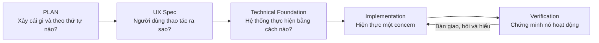

# Thiết kế flow phát triển ứng dụng

## Mục đích

Tài liệu này tóm tắt cách project đi từ ý tưởng đến code theo từng bước nhỏ. Mỗi
run chỉ giải quyết **một concern rõ ràng** để người học có thể dừng lại, đặt câu
hỏi, hiểu quyết định vừa được đưa ra rồi mới tiếp tục.



## 1. PLAN — xác định phạm vi và thứ tự

`PLAN.md` trả lời:

- Sản phẩm cần tạo ra kết quả gì cho người dùng?
- Phase nào phải làm trước?
- Definition of Done là gì?
- Những chức năng nào chưa được phép đưa vào?

Phase 1 được chọn là **Manual Project/Task Core**. Manager tạo project và giao
task; Employee xem task được giao và cập nhật trạng thái. AI chưa xuất hiện.

### Tại sao làm PLAN trước?

Nếu code ngay từ ý tưởng lớn, project dễ thêm quá nhiều công nghệ nhưng không có
flow nào hoàn chỉnh. PLAN giữ thứ tự vertical slice và ngăn các chức năng tương
lai như RAG, Kubernetes hoặc AI Agent lọt vào Phase 1.

## 2. UX Spec — chuyển phạm vi thành hành vi người dùng

Từ PLAN, `phase-1/UX_SPEC.md` mô tả flow có thể quan sát được:

```text
Manager đăng nhập
→ tạo project
→ tạo và giao task
→ Employee đăng nhập
→ xem My Tasks
→ cập nhật trạng thái
→ Manager thấy trạng thái mới
```

UX Spec chốt:

- Các màn hình và wireframe low-fidelity.
- Hành động của Manager, Admin và Employee.
- Trường dữ liệu tối thiểu trong form.
- Workflow `TO_DO → IN_PROGRESS → DONE`.
- Loading, empty, validation và error state.
- Giao diện Việt/Anh qua translation key.

### Tại sao chưa làm giao diện đẹp ngay?

Wireframe dùng để kiểm tra **đúng flow** trước khi đầu tư vào màu sắc và component.
Nếu quyền hoặc hành vi còn sai, sửa một tài liệu rẻ và dễ hiểu hơn sửa nhiều tầng
frontend, API và database.

## 3. Technical Foundation — chuyển hành vi thành contract kỹ thuật

`phase-1/TECHNICAL_FOUNDATION.md` trả lời hệ thống sẽ thực hiện UX Spec như thế
nào. Những quyết định chính gồm:

- Next.js/TypeScript cho frontend và FastAPI/Python cho backend.
- PostgreSQL là business source of truth.
- Modular monolith với hướng phụ thuộc `API → application → domain → port`.
- Local session authentication với account seed cho Phase 1.
- Data model, tenant context, RLS và composite foreign key.
- REST API dưới `/api/v1`.
- Structured error, idempotency và optimistic concurrency contract.
- Authorization matrix và chiến lược test.

### Tại sao cần contract trước code?

Frontend, backend và database được làm ở các run khác nhau nhưng vẫn phải khớp
nhau. Contract giúp mỗi run biết rõ input, output, quyền và lỗi cần xử lý, tránh
việc frontend tự đoán API hoặc database tự tạo business rule.

## 4. Frontend foundation — implementation đầu tiên

Run implementation đầu tiên chỉ scaffold `frontend/`, gồm:

- Next.js 16, React 19 và TypeScript strict.
- pnpm và lockfile để cài dependency tái lập được.
- Tailwind CSS.
- `next-intl` với resource tiếng Việt và tiếng Anh.
- TanStack Query và Zod làm boundary cho server state/schema ở bước sau.
- ESLint, Vitest, Testing Library và Playwright foundation.
- Một application shell tối thiểu và smoke test hai locale.

Run này **không** làm login, Project, Task, backend, database hoặc Docker.

### Tại sao chỉ scaffold frontend?

Mục tiêu là kiểm tra toolchain trước khi có business code. Nếu build, typecheck,
test hoặc i18n config sai, ta sửa chúng trong một phạm vi nhỏ và biết chính xác lỗi
thuộc tầng nào.

Trong run này, test đã phát hiện DOM không cleanup giữa hai locale và production
build đã phát hiện thiếu `next-intl` request config. Hai lỗi được sửa trước khi
bàn giao, cho thấy quality gate giúp tìm lỗi sớm hơn feature implementation.

## 5. Backend FastAPI foundation — implementation thứ hai

Run tiếp theo chỉ tạo nền móng cho `backend/`, gồm:

- Cài `uv` ở user environment để quản lý Python, dependency và virtual
  environment của backend.
- Dùng `uv` cài CPython 3.13 riêng cho project, không thay đổi Python hệ thống.
- Khai báo dependency trong `backend/pyproject.toml` và khóa phiên bản bằng
  `backend/uv.lock`.
- Tạo FastAPI application factory và configuration boundary bằng
  `pydantic-settings`.
- Thêm request ID middleware và một structured error contract dùng chung.
- Thiết lập Ruff, Pyright strict, Pytest, pytest-asyncio và coverage.
- Test ứng dụng trực tiếp qua ASGI bằng async HTTP client.

`uv` hiện đã dùng được. Hai lệnh quan trọng là:

```bash
uv sync --locked                 # tạo môi trường đúng theo uv.lock
uv run fastapi dev app/main.py   # chạy FastAPI bên trong môi trường đó
```

Run này **không** kết nối PostgreSQL, không thêm SQLAlchemy/Alembic, Docker,
authentication hoặc API Project/Task.

### Tại sao làm backend foundation trước database và feature?

Ta cần chứng minh môi trường Python có thể được tái tạo và FastAPI có contract
lỗi ổn định trước khi business code phụ thuộc vào nó. Application factory giúp
runtime và test dùng cùng cách khởi tạo; structured error sớm giúp các endpoint
sau không tự tạo mỗi nơi một kiểu lỗi.

Quality gate của run đã phát hiện ba vấn đề thực tế:

- Tạo `.venv` trực tiếp trên ổ `/mnt/c` rất chậm, nên lần kiểm tra dùng virtual
  environment tạm và xóa môi trường dở dang khỏi repository.
- `TestClient` bị treo ở blocking portal trong môi trường hiện tại, nên test được
  chuyển sang `AsyncClient` với `ASGITransport`.
- Response lỗi 500 ban đầu thiếu header request ID; test bắt được và contract đã
  được sửa.

Kết quả cuối: Ruff và format pass, Pyright strict không có lỗi, 5/5 test pass,
coverage 100%, và `uv lock --check` pass với 55 package được khóa.

## 6. Database code foundation — implementation thứ ba

Run này thiết lập cách backend làm việc với PostgreSQL nhưng chưa cần database
đang chạy:

- Thêm SQLAlchemy async, Alembic và `psycopg` theo technical foundation.
- Thêm `APP_DATABASE_URL` và chặn URL không dùng PostgreSQL/driver đã chọn.
- Tạo async engine, session factory và metadata naming convention.
- Khởi tạo Alembic async environment; chưa tạo migration hoặc bảng nghiệp vụ.
- Test engine/session mà không mở network connection và test Alembic structure.

### Tại sao chưa tạo bảng ngay?

Run này chỉ kiểm tra persistence toolchain và contract kết nối. Bảng Organization,
User, Project và Task cần đi cùng migration, tenant constraint, RLS và test của
vertical slice tương ứng; thêm sớm sẽ khiến một run nhỏ vô tình triển khai feature.

Kết quả: Ruff/format pass, Pyright strict không có lỗi, 9/9 test pass với coverage
100%, Alembic load head và render offline thành công. Kết nối PostgreSQL thật chưa
được kiểm tra vì Docker/PostgreSQL thuộc run kế tiếp.

Run cũng cho thấy `.venv` trên `/mnt/c` chậm khi `uv` phải copy nhiều file nhỏ.
Quality gate được chạy trong virtual environment trên filesystem Linux và local
`backend/.venv` trỏ tới đó; vị trí dependency này bị Git ignore và không thay đổi
source hay lockfile.

## 7. Local PostgreSQL infrastructure — implementation thứ tư

Run này đưa database thật vào local development nhưng vẫn chưa triển khai business
schema:

- Thêm `compose.yaml` chỉ có service PostgreSQL 18.4.
- Chỉ publish port `5432` trên `127.0.0.1`.
- Dùng named volume để dữ liệu không mất khi dừng container.
- Thêm healthcheck bằng `pg_isready` và local configuration trong `.env.example`.
- Cập nhật lệnh start, verify và stop trong README.

PostgreSQL 18 dùng volume mount tại `/var/lib/postgresql`; image tự quản lý data
directory theo major version bên trong. API và frontend chưa được container hóa vì
đó là concern khác.

### Cách kiểm tra infrastructure thật

```text
docker compose config
→ docker compose up -d postgres
→ container healthy
→ psql xác nhận database/user/version
→ alembic upgrade head
→ alembic current --check-heads
```

Kết quả: container healthy, database/user đều là `work_management`, server chạy
PostgreSQL 18.4 và Alembic kết nối database thật thành công. Chưa có revision nên
`upgrade head` hiện là no-op; migration tạo schema sẽ thuộc run tiếp theo.

## 8. Identity/Organization schema — implementation thứ năm

Run này tạo revision đầu tiên và chỉ tập trung vào nền dữ liệu tenant/local auth:

- Tạo ORM metadata và migration cho `organizations`, `users`, `memberships` và
  `auth_sessions`.
- `users` là global identity; `memberships` và `auth_sessions` luôn có
  `organization_id`.
- Session chỉ lưu `token_hash`, không lưu raw token.
- Composite foreign key ngăn session tham chiếu membership của organization khác.
- PostgreSQL roles `migration_owner` và `app_runtime` đều không có `BYPASSRLS`.
- Bật `ENABLE/FORCE ROW LEVEL SECURITY` cho hai bảng tenant-owned.

RLS sử dụng transaction-local tenant context:

```text
SET LOCAL app.organization_id = <organization UUID>
→ query chỉ thấy row cùng organization
→ thiếu context thì default deny
→ write khác organization bị PostgreSQL từ chối
```

Revision đã được kiểm tra theo chuỗi `upgrade → downgrade base → upgrade`, sau đó
`alembic check` xác nhận ORM metadata không lệch database. Kết quả cuối: Ruff và
format pass, Pyright không lỗi, 15/15 test pass, coverage 100%; integration test
chứng minh default-deny, tenant A không thấy tenant B và cross-tenant write trả
SQLSTATE `42501`.

Run này chưa hash/seed password, chưa cấp credential đăng nhập cho runtime role,
chưa có login/session API và chưa tạo Project/Task.

## 9. Demo seed và Make workflow — implementation thứ sáu

Run này biến schema identity thành dữ liệu local có thể dùng ở các bước auth sau:

- Hash password bằng Argon2 qua `pwdlib`; database không lưu password dạng rõ.
- Seed idempotent một organization cùng ba persona Admin, Manager và Employee.
- Chỉ cho phép seed khi environment là `local` và cờ demo được bật rõ ràng.
- Thêm `backend/Makefile` với `make up`, `make migrate`, `make seed` và quality gate.
- Thêm root `Makefile`; chạy `make` sẽ install dependency, chờ PostgreSQL healthy,
  migrate, seed rồi mở FastAPI và Next.js song song.

```text
make
→ install dependency từ lockfile
→ docker compose up PostgreSQL
→ alembic upgrade head
→ seed ba account demo
→ FastAPI :8000 + Next.js :3000
```

Seed được chạy hai lần để chứng minh lần sau không tạo trùng: lần đầu tạo ba user
và ba membership, lần hai đều trả về `0`. Integration test còn kiểm tra password
hash Argon2 và hành vi khi global user đã tồn tại nhưng organization mới cần tạo
membership.

Ba account local được tạo là:

| Role | Email |
| --- | --- |
| Admin | `admin@example.test` |
| Manager | `manager@example.test` |
| Employee | `employee@example.test` |

Password demo được cấu hình riêng cho local environment. Seed không in password
hash và không được phép chạy nếu thiếu cờ `APP_DEMO_SEED_ENABLED=true` hoặc nếu
environment không phải `local`.

Quality gate của run gồm Ruff/format, Pyright strict, 17 unit test backend, 3
PostgreSQL integration test và 2 frontend test. Lệnh root `make` cũng được chạy
thật; FastAPI và Next.js đều trả HTTP 200. Trên WSL `/mnt/c`, Vitest dùng thread
worker trong root Makefile để tránh timeout khi tạo fork process.

Thay đổi được lưu tại Git checkpoint:

```text
b64d673 feat(auth): add identity schema and demo seed workflow
```

Commit đã được push lên `main`.

Run này chưa tạo login/session API hay giao diện đăng nhập. Seed chỉ cung cấp dữ
liệu đầu vào đáng tin cậy cho run auth backend kế tiếp.

## 10. Backend authentication API — implementation thứ bảy

Run này biến ba account demo thành flow đăng nhập thật nhưng chỉ triển khai tầng
backend:

```text
POST /api/v1/auth/login
→ normalize email + verify Argon2 password
→ resolve organization từ server config
→ SET LOCAL ROLE app_runtime
→ SET LOCAL app.organization_id
→ RLS resolve active membership
→ tạo raw token ngẫu nhiên cho HttpOnly cookie
→ chỉ lưu SHA-256 token trong auth_sessions
→ ghi audit auth.login.succeeded
```

Hai API còn lại là `GET /api/v1/me` để resolve actor hiện tại và
`POST /api/v1/auth/logout` để revoke session. Logout gọi lặp lại vẫn trả `204` và
không tạo thêm side effect.

Organization UUID trong cookie chỉ là locator để chọn candidate tenant context;
nó không phải bằng chứng phân quyền. Session hash vẫn phải tồn tại, chưa revoke,
chưa hết hạn và trỏ tới active membership trong cùng organization. Integration
test thay UUID bằng tenant khác và nhận `401 SESSION_EXPIRED`.

Migration `0002` thêm `audit_events` append-only, RLS default-deny và chỉ cấp
`SELECT/INSERT` cho `app_runtime`. Login sai với user đã resolve an toàn ghi audit
`REJECTED`; email không tồn tại không tạo tenant audit để tránh gán nhầm tenant.
Password, raw token và cookie không xuất hiện trong audit.

Quality gate cuối của run:

```text
Ruff + format               pass
Pyright strict              0 lỗi
Backend unit tests          22 passed
PostgreSQL integration      4 passed
Alembic current/check       0002 head, không lệch metadata
Migration round trip        0002 → 0001 → 0002 pass
TCP smoke test              login 200, me 200, logout 204
```

Khi test bằng Swagger, request body phải là JSON hợp lệ. Ví dụ password phải có
dấu nháy đóng:

```json
{
  "email": "manager@example.test",
  "password": "WorkDemo123!"
}
```

JSON sai bị chặn ở transport validation trước khi chạy logic login và trả
`422 VALIDATION_FAILED`. OpenAPI 422 schema dùng cùng structured `ErrorResponse`
với runtime; lỗi parse JSON trỏ tới `field: body` thay vì vị trí ký tự khó hiểu.

Run này chưa làm login UI, member API, Project hoặc Task. Bước frontend login vẫn
là một run riêng để giữ ranh giới học tập.

## 11. Frontend authentication UI — implementation thứ tám

Run này nối giao diện với authentication API đã có, không thêm behavior Project
hoặc Task:

```text
Mở ứng dụng
→ GET /api/v1/me để bootstrap session
→ chưa đăng nhập thì chuyển tới /login
→ POST /api/v1/auth/login qua same-origin proxy
→ browser tự giữ HttpOnly cookie
→ vào application shell và hiển thị actor/organization/role
→ POST /api/v1/auth/logout rồi quay lại /login
```

Frontend dùng TanStack Query để quản lý server state, Zod để kiểm tra contract
response và một `AuthProvider` để chia sẻ trạng thái actor. Browser chỉ gọi
`/api/v1`; Next.js proxy request sang FastAPI `:8000`. Cách này giữ cookie cùng
origin và JavaScript không cần, cũng không được, đọc raw session token.

Form và các trạng thái loading, sai credentials, session hết hạn, backend không
sẵn sàng đều dùng translation key Việt/Anh. Trang chính mới chỉ là authenticated
shell; nhãn Project/My Tasks là thông báo bước sau, chưa phải business feature.

Quality gate của concern gồm 7 frontend test, lint, TypeScript và production
build. Smoke test thật qua port `3000` xác nhận chuỗi `login 200 → me 200 → logout
204 → me 401`; cookie có `HttpOnly` và `SameSite=Lax`.

### Lưu ý WSL, `/mnt/c` và OOM khi chạy dev

Next.js 16 mặc định dùng Turbopack. Trong môi trường WSL giới hạn 6 GB của project
này, lần compile `/login` đầu tiên bằng Turbopack đã làm WSL bị OOM. Lệnh dev được
đổi sang `next dev --webpack`; đây chỉ là bundler cho development, không thay đổi
production build hoặc behavior ứng dụng.

Webpack đã compile `/login` thành công với RAM toàn WSL khoảng 1.6/5.8 GB, không
dùng swap. Lần compile đầu mất khoảng 40 giây nhưng lần tải đã cache chỉ khoảng
0.1 giây. Phần chậm còn lại đến từ I/O qua `p9_client_rpc` vì repository nằm trên
filesystem Windows `/mnt/c`; đặt project trên filesystem Linux của WSL sẽ nhanh
hơn nếu cần tối ưu vòng lặp development.

## 12. Flow chuẩn cho mỗi run tiếp theo

Mỗi run áp dụng chu trình:

```text
1. Chọn đúng một concern
2. Đọc PLAN và contract liên quan
3. Nêu rõ phạm vi làm / không làm
4. Implement thay đổi nhỏ nhất có giá trị
5. Viết hoặc cập nhật test của concern đó
6. Chạy lint, typecheck, test và build phù hợp
7. Báo cáo file thay đổi, kết quả kiểm tra và phần chưa làm
8. Người học hỏi và xác nhận trước run tiếp theo
9. Commit khi thay đổi đã được duyệt
```

### Ví dụ ranh giới run

| Run | Chỉ thực hiện | Chưa thực hiện |
| --- | --- | --- |
| Frontend foundation | Framework, i18n, test tooling | Login và business UI |
| Backend foundation | FastAPI shell, config, lint/test | Database và auth |
| Database foundation | PostgreSQL, Alembic, connection | Project/Task feature |
| Local infrastructure | Docker/Compose và run commands | Business behavior |
| Auth backend | Login, session cookie, `/me` | Login UI |
| Auth frontend | Form login và session states | Project/Task |
| Project backend | Domain, API, RLS, audit, tests | Project UI |
| Project frontend | List/create/edit project | Task feature |

Ranh giới này không có nghĩa các tầng độc lập về thiết kế. Chúng được kết nối bởi
contract đã chốt, nhưng được implement và giải thích ở các run riêng.

## 13. Cách đọc các artifact

| Artifact | Câu hỏi nó trả lời |
| --- | --- |
| `PLAN.md` | Làm cái gì, khi nào xong và chưa làm gì? |
| `UX_SPEC.md` | Người dùng nhìn thấy và thao tác như thế nào? |
| `TECHNICAL_FOUNDATION.md` | Các tầng giao tiếp và bảo vệ dữ liệu ra sao? |
| Source code | Quyết định đã được hiện thực như thế nào? |
| Tests | Bằng chứng nào cho thấy behavior và invariant đúng? |
| Commit | Một mốc thay đổi nhỏ có thể đọc, demo và hoàn tác |

## 14. Trạng thái hiện tại và bước kế tiếp

Đã hoàn thành:

```text
PLAN
→ Phase 1 UX Spec
→ Phase 1 Technical Foundation
→ Frontend foundation
→ Frontend lint/typecheck/test/build
→ Backend FastAPI foundation
→ Backend lint/typecheck/test/lock check
→ Database code foundation
→ Database lint/typecheck/test/Alembic offline check
→ Local PostgreSQL Compose
→ PostgreSQL health/psql/Alembic live check
→ Identity/Organization ORM + migration
→ RLS/cross-tenant/migration integration checks
→ Argon2 password hashing + idempotent local demo seed
→ Backend/root Make workflow
→ One-command startup verified on ports 8000 and 3000
→ Commit b64d673 pushed to main
→ Backend login/session/me/logout API
→ Audit event migration 0002 + auth/RLS integration tests
→ Swagger/curl login flow verified
→ Frontend login/session/logout UI bằng translation key Việt/Anh
→ Same-origin API proxy và typed response contracts
→ Frontend auth tests/lint/typecheck/build
→ Browser-facing auth smoke test qua port 3000
```

Bước tiếp theo được đề xuất là **Project backend** của Phase 1: domain/application
service, migration tenant-owned, RLS, authorization, audit, idempotency và API/test
cho Project. Run đó chưa làm Project UI hoặc Task.

## 15. Workflow local WSL-native đã chấp nhận

Codex và toàn bộ lệnh repository chạy trong Ubuntu WSL2 từ checkout canonical
`/home/btl4w/code/ai-native-work-management`. PowerShell chỉ dùng cho thao tác
host như backup hoặc quản lý WSL. Repository không còn chạy qua `/mnt/c`.

### Lý do migration và runtime đã xác minh

Checkout cũ trên `/mnt/c` phải đi qua lớp filesystem Windows/WSL, làm các workload
nhiều file như pnpm, ESLint, TypeScript và test chậm. Trạng thái cũ còn từng trộn
Windows CPython và Windows Corepack với Ubuntu. Checkout mới dùng riêng runtime
Linux:

```text
GNU Make 4.3 và Bash /usr/bin/bash
Node v24.18.1 + Corepack dưới ~/.nvm
uv Linux và backend/.venv/bin/python báo Linux
Docker client/server 28.5.1
```

`uv sync --locked` và `corepack pnpm@10 install --frozen-lockfile` đã tạo lại
dependency trong filesystem Linux. `backend/uv.lock` và `frontend/pnpm-lock.yaml`
không thay đổi.

### Quy tắc vận hành và bảo vệ

- Không copy hoặc dùng lại `.venv`, `node_modules` hay cache từ checkout Windows.
- Không dùng `git clean` diện rộng; các planning document local đang bị Git ignore
  và phải được backup riêng trước migration hoặc cleanup.
- Dùng `~/code/ai-native-work-management` cho Codex, Git và mọi project command.
- Chỉ xóa checkout Windows sau khi clone WSL, patch, tài liệu local, dependency và
  quality gate đều được xác minh.

### Evidence sau migration

Trên filesystem Linux-native, các gate đã pass và nhanh hơn rõ rệt so với checkout
`/mnt/c`:

```text
make lint      → exit 0: Ruff và ESLint pass; 3.09 giây
make typecheck → exit 0: Pyright 0 errors, 0 warnings; tsc clean; 7.37 giây
make test      → exit 0: 22 backend tests passed, 4 deselected;
                  2 frontend files / 7 tests passed; 6.73 giây
make migration-check → exit 0: Alembic ở revision 0002 (head), không phát hiện
                       migration mới; 4 integration tests passed
```

Concern migration này không thay đổi application behavior, database schema, API
contract, frontend feature hoặc Phase 1 business scope.

### Phần vẫn chưa xác minh

- Dev server, browser smoke và production frontend build chưa được chạy.
- `pnpm` cảnh báo bỏ qua build script của `@parcel/watcher`, `@swc/core`, `sharp`
  và `unrs-resolver`; các native path này chưa được xác minh trực tiếp.
